# ASLAN AI GUARDIAN PLATFORM - Technical Workflow

## BOI Submission & Project Implementation Workflow

---

## 1. BOI Document Submission Flow

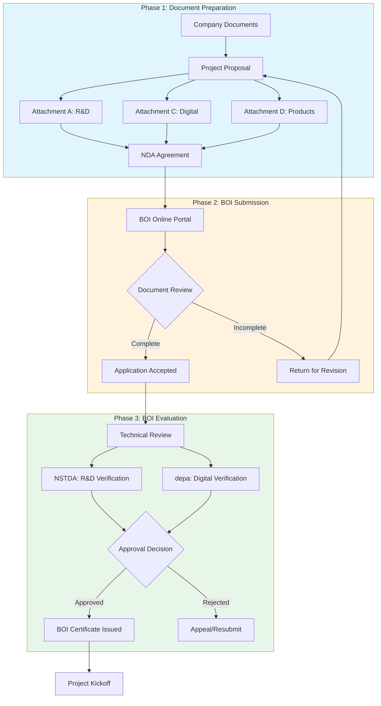

---

## 2. Required Documents Checklist

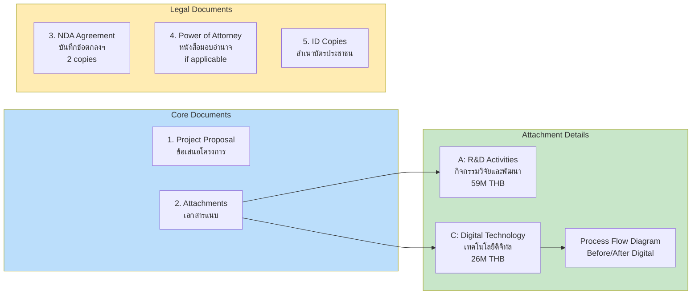

---

## 3. Project Implementation Timeline (12 Months)

```mermaid
gantt
    title ASLAN AI GUARDIAN - 12 Month Project Timeline
    dateFormat  YYYY-MM
    section Phase 1 (Month 1-6)
    R&D Activity 1: Physical AI Agent Development    :a1, 2026-06, 6M
    R&D Activity 2: XAI Framework Development        :a2, 2026-06, 5M
    R&D Activity 3: Thai NLP Model Training          :a3, 2026-07, 5M
    Milestone 1: Working Prototype (3 Agents)        :milestone, m1, 2026-11, 1d

    section Phase 2 (Month 7-12)
    R&D Activity 4: Fraud Pattern Recognition        :a4, 2026-11, 4M
    R&D Activity 5: Multi-Agent Integration          :a5, 2026-12, 4M
    Digital Infrastructure Deployment                :d1, 2027-01, 4M
    UAT & Testing                                    :t1, 2027-03, 2M
    Milestone 2: Production System (5 Agents)        :milestone, m2, 2027-05, 1d
```

---

## 4. Multi-Agent AI Architecture

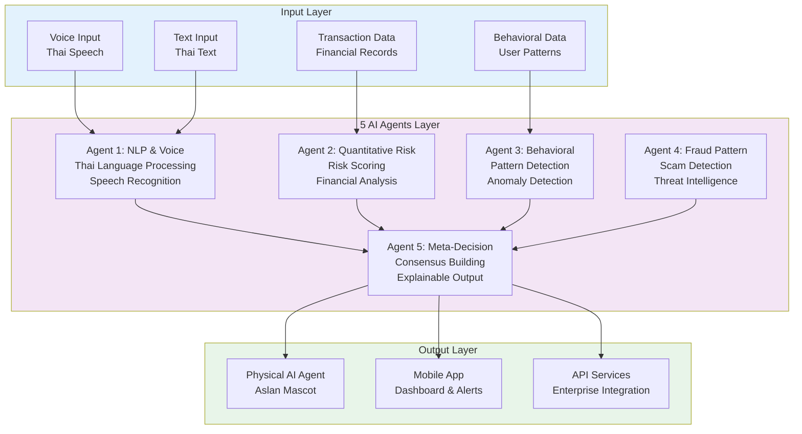

---

## 5. Budget Allocation Flow

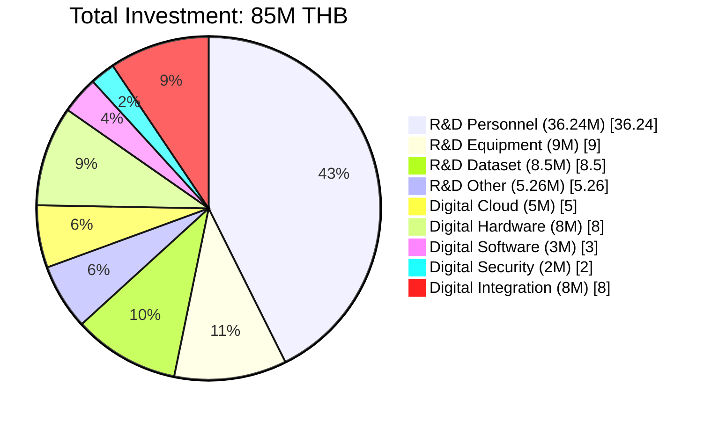

---

## 6. R&D Activities Breakdown

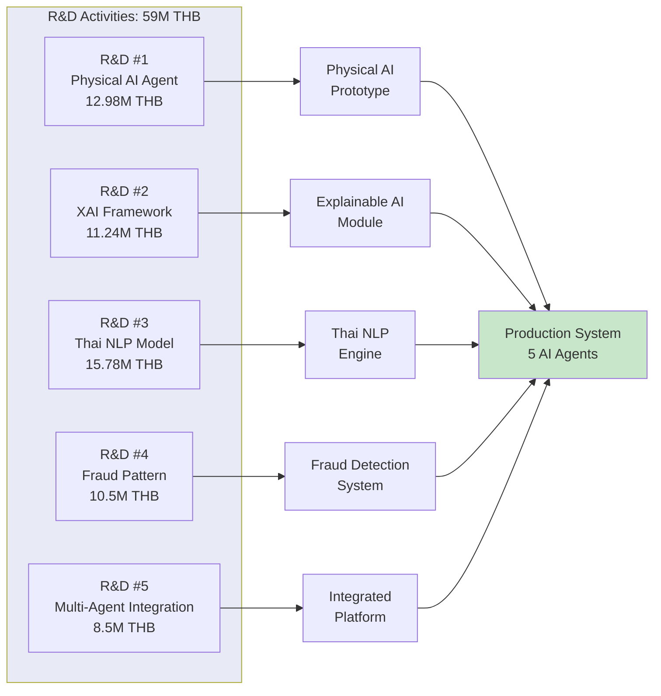

---

## 7. Digital Technology Implementation

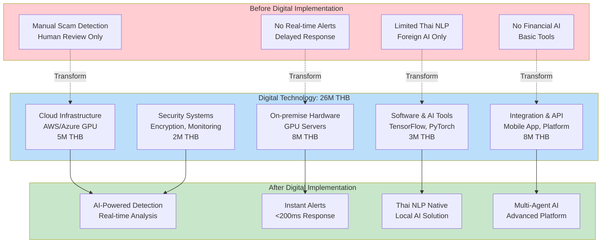

---

## 8. KPI Verification Flow

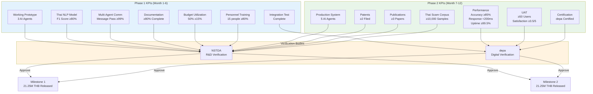

---

## 9. Physical AI Agent System Architecture

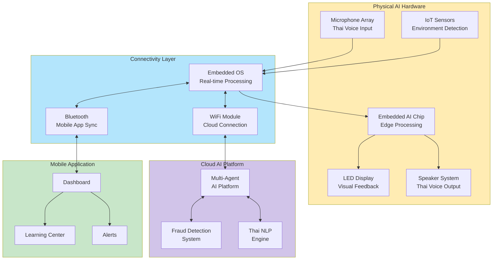

---

## 10. BOI Compliance Matrix

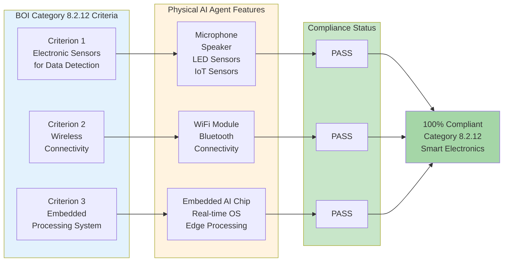

---

## 11. Fund Disbursement Flow

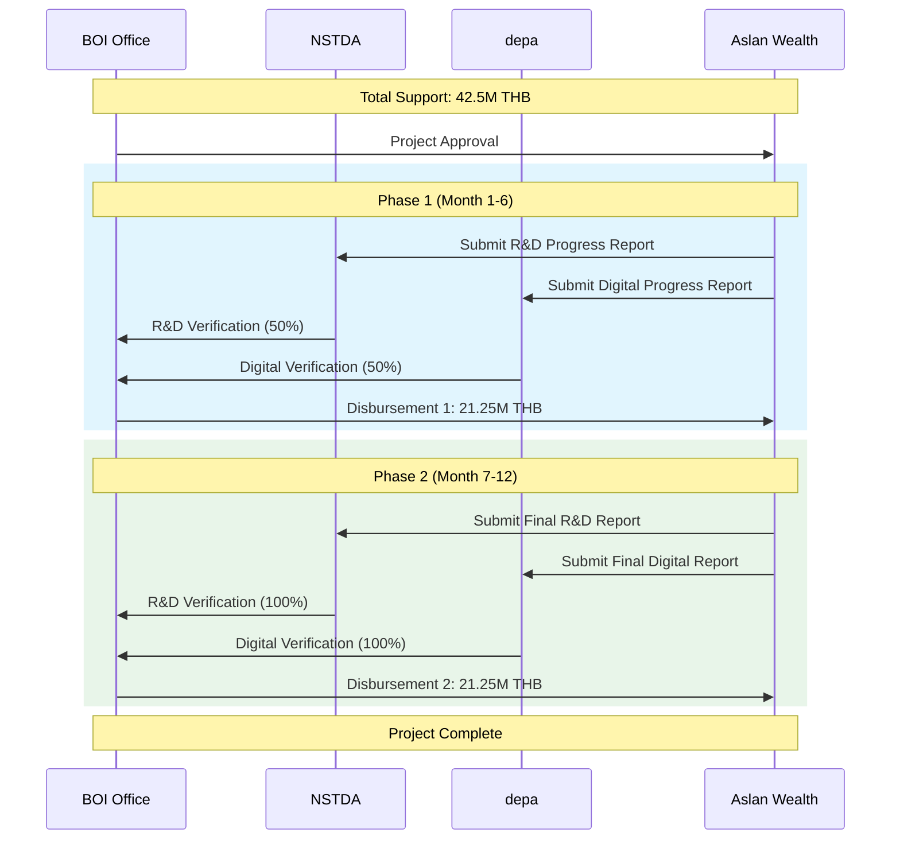

---

## 12. Data Flow Architecture

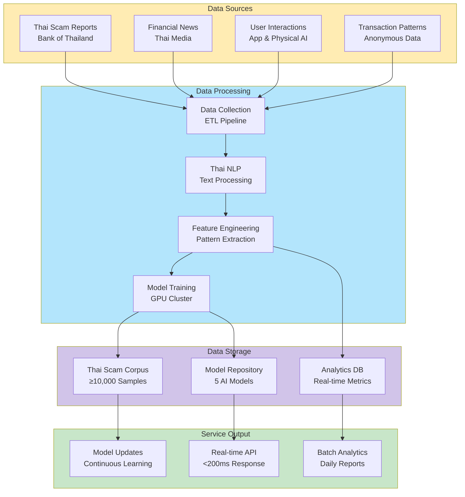

---

## Quick Reference

| Document | Location | Purpose |
|----------|----------|---------|
| Project Proposal | `01_Submission/BOI_COMPLETE_CONSOLIDATED.docx` | Main BOI form data |
| Attachment A | `02_Attachments/attachment_a_rd_COMPLETE.html` | R&D activities detail |
| Attachment C | `02_Attachments/attachment_c_digital_COMPLETE.html` | Digital technology detail |
| Attachment D | `02_Attachments/attachment_d_product_details.html` | Product specifications |
| NDA | `05_Government_Documents/บันทึกข้อตกลงฯ.pdf` | Non-disclosure agreement |

---

## Investment Summary

| Category | Amount | BOI Support |
|----------|--------|-------------|
| R&D Activities | 59,000,000 THB | 29,500,000 THB |
| Digital Technology | 26,000,000 THB | 13,000,000 THB |
| **Total** | **85,000,000 THB** | **42,500,000 THB** |

---

*Document Version: 2.0*
*Last Updated: January 2025*
